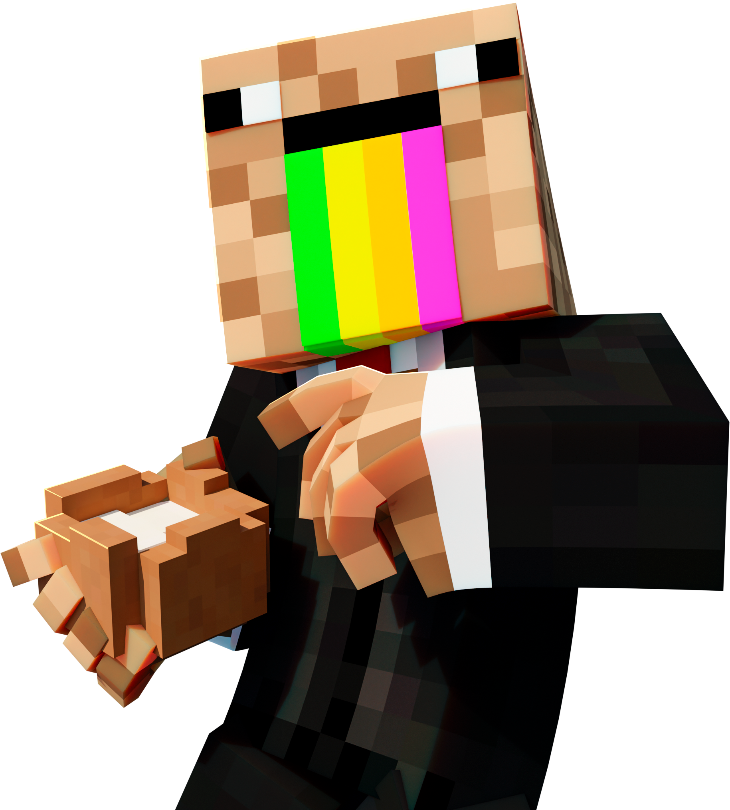

<!-- ====== TOP BANNER ====== -->

  

<!-- =========================
  Moonky Profile README (EN)
  Needs in /assets/:
  - about.png
  - skin.png
  - nowplaying-ey-chory-feid-animated-v6.gif
  - divider-red-animated.gif
  - banner_animado_sin_link.gif
=========================== -->

<!-- Title + two-column layout (text left, skin right) -->
<table>
  <tr>
    <td width="64%" valign="middle">
      <h2>👋 Hi, I’m Moonky</h2>
      <ul>
        <li>I build <strong>Discord automations</strong> and <strong>Minecraft (Towny)</strong> integrations.</li>
        <li>I speak <strong>Spanish</strong> and <strong>English</strong>.</li>
        <li>I’ve been building <strong>bots for 4 years</strong>.</li>
        <li>I focus on <strong>clean UX</strong>, solid <strong>role syncs Discord⇄Minecraft</strong>, <strong>RCON</strong> utilities, and <strong>lightweight dashboards</strong>.</li>
      </ul>
    </td>
    <td width="36%" valign="middle" align="right">
      
    </td>
  </tr>
</table>

<!-- Anthem / Now Playing -->

  <strong>“U U U U UUUUU — Ferxxoooo</strong>

  

  

## ⚙️ What I build
- Discord⇄Minecraft verification with role synchronization  
- Tickets & suggestions (with logs)  
- RCON commands: status, panel hooks, automation  
- Server insights & metrics *(in progress)*

  

## 🏆 Top Bots (minimal)
- **CocoCraft-Bot** — **Active**  
  Stack: Node.js · discord.js · Railway

- **Maple Village — Suggestions** — **Active**  
  Stack: Node.js · discord.js

- **Baby** — **In development**  
  Stack: Node.js · discord.js

  

## 🏛️ Organization
**CocoCraft-Minecraft-Server** — bots, panel, and server assets.  
👉 **[Visit the organization »](https://github.com/CocoCraft-Minecraft-Server)**

  

## 📊 GitHub Stats

  
  

## 📫 Contact
- **Discord:** Moonky_  
- **Org:** CocoCraft-Minecraft-Server
