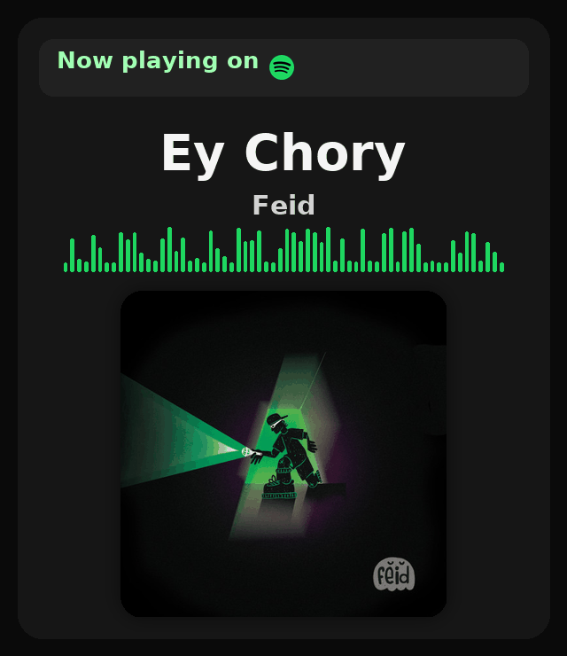

  

  

## 👋 Hola, soy Moonky
<!-- Skin al lado derecho, tamaño completo (sin width) -->

Construyo bots de Discord y automatizaciones para servidores **Minecraft (Towny)**.  
Me enfoco en integraciones Discord⇄Minecraft (roles, verificación, tickets, sugerencias), **RCON**, comandos y paneles ligeros.

 

  

## ⚙️ Tech / Stack

  
  
  
  
  

- Verificación Discord⇄Minecraft (roles y sincronización)
- Tickets y sugerencias con logs
- Comandos /panel, /status (RCON), /playtime
- Métricas/insights del servidor *(en progreso)*

  

## 🏛️ Organización
**CocoCraft-Minecraft-Server** — repos de bots, panel y assets del servidor.  
👉 **[Visitar organización »](https://github.com/CocoCraft-Minecraft-Server)**

  

## 🏆 Top bots
| # | Bot | Repositorio | Stack | Estado |
|---:|-----|:-----------|:------|:------|
| 🥇 | **CocoCraft-Bot** | https://github.com/CocoCraft-Minecraft-Server/CocoCraft-Bot | Node.js · discord.js · Railway | Activo |
| 🥈 | **Maple Village – Sugerencias** | _añade el enlace_ | Node.js · discord.js | Activo |
| 🥉 | **Baby** | _añade el enlace_ | Node.js · discord.js | En desarrollo |

  

## 📫 Contacto
- **Discord:** Moonky_
- **Org:** CocoCraft-Minecraft-Server
