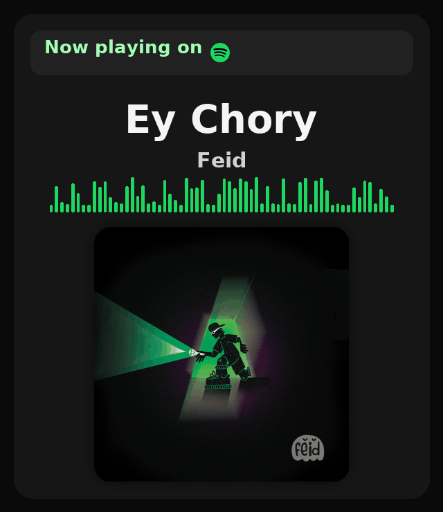

<!-- ====== TOP BANNER ====== -->

  

<table>
  <tr>
    <td width="64%" valign="middle">
      <h2>Hi, I'm Moonky 👨‍💻</h2>
      

        Self-taught developer specialized in <strong>Discord automation</strong>,
        <strong>Minecraft server integrations</strong>, and <strong>web design & development</strong>.
      

      <ul>
        <li>4+ years building Discord bots and automation systems.</li>
        <li>Everything I've built has been self-driven and continuously improved.</li>
        <li>Focused on clean UX, scalable architecture, and modular bot systems.</li>
        <li>Advanced experience with Discord ⇄ Minecraft role synchronization.</li>
        <li>RCON automation, dashboards, logs, and structured systems.</li>
        <li>Web design & custom dashboards built for real teams.</li>
      </ul>
      

        I build systems that feel simple for users — but powerful behind the scenes.
      

    </td>
    <td width="36%" valign="middle" align="right">
      
    </td>
  </tr>
</table>

  <strong>EY CHOOOORYYYYYY</strong>

  

  

## 🚀 Core Focus

- Discord ⇄ Minecraft verification systems
- Advanced role synchronization logic
- Ticket & suggestion systems with structured logs
- Custom embed builders
- Moderation & automation commands
- RCON utilities & server integrations
- Lightweight dashboards & monitoring
- Web design & custom page development

  

## 🧠 Tech Stack

**Language & Runtime**
Node.js (JavaScript) · JavaScript (ES6+)

**Main Libraries**
discord.js · React · Vite

**Development Environment**
Visual Studio Code

**Hosting & Deployment**
Railway · Bloom Hosting · Vercel · VPS environments

**Other Tools**
Git · REST APIs · Google Sheets API · JSON storage · RCON integrations

  

## 🏆 Featured Projects

### 📊 Pulse Dashboard — Featured

> Real-time agent performance tracking built for call center team leaders and supervisors.

**What it does:**
- Live transfer metrics per agent pulled directly from Google Sheets
- Team overview across all 6 regions (Philippines, Venezuela, Colombia, Mexico, Central America, Asia)
- Daily goal tracking — flags who hit 20 English transfers, who's in progress, and who's at zero
- Top 3 leaderboard per team (English, Spanish, Total)
- Auto-refreshes every 60 seconds — no manual updates needed

**Who it's for:** Team Leaders, Supervisors, and QA only. Users register once with Google and select their team permanently.

**Stack:** React · Vite · React Router · Google Sheets CSV API · Vercel

👉 [View Repository](https://github.com/Moonky1/pulse-dashboard)

  

## 📊 GitHub Stats

  &nbsp;&nbsp;
  

  

  

## 📬 Contact

- **Discord:** Moonky_
- **GitHub Org:** [CocoCraft-Minecraft-Server](https://github.com/CocoCraft-Minecraft-Server)
